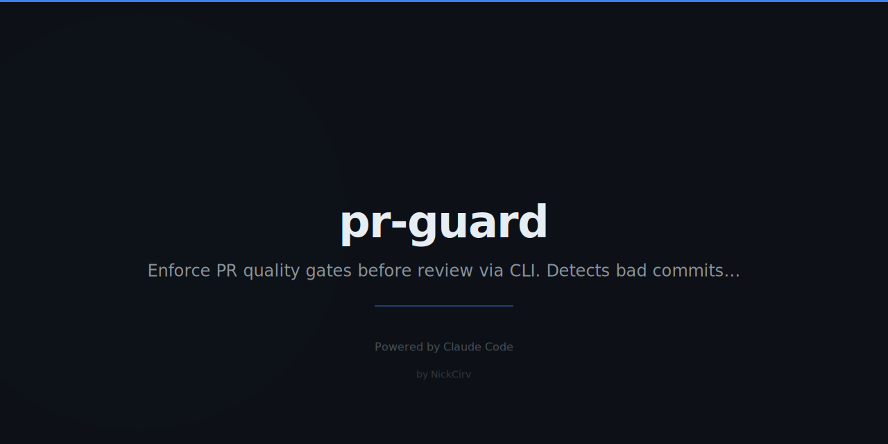

# PR Guard

Stop reviewing bad PRs. Let the robot do it.

[](https://github.com/marketplace/actions/pr-guard)
[](https://www.npmjs.com/package/pr-guard)
[](LICENSE)
[](##configuration)

PR Guard automatically checks commit messages, branch names, PR descriptions, file sizes, secrets, and merge conflicts — before a single human reads your PR.

```
  PR-GUARD  v1.0.0

  Checking PR quality...

  ✓  Branch naming       fix/auth-timeout            PASS
  ✓  Commit messages     4/4 conventional            PASS
  ✗  PR description      Too short (23 chars)        FAIL
  ✓  File limits         12 files, max 89KB          PASS
  –  Merge conflicts     No changed files detected   SKIP
  ✓  No secrets          No .env or key files        PASS

  ───────────────────────────────────────────────────────
  Result: 4 passed │ 1 failed │ 1 skipped
  ───────────────────────────────────────────────────────

  Fix: Add a description with at least 50 characters explaining what and why.
```

---

## Quick Start

### As a GitHub Action

Add this workflow to `.github/workflows/pr-guard.yml`:

```yaml
name: PR Guard
on:
  pull_request:
    types: [opened, synchronize, edited]

jobs:
  guard:
    runs-on: ubuntu-latest
    steps:
      - uses: actions/checkout@v4
        with:
          fetch-depth: 0
      - uses: NickCirv/pr-guard@v1
        with:
          token: ${{ secrets.GITHUB_TOKEN }}
```

That's it. Zero configuration required.

### As a CLI (local development)

```bash
npm install -g pr-guard

# Run all checks on your current branch
pr-guard

# Run a specific check
pr-guard --check commits

# Use a custom config
pr-guard --config .prguard.yml

# Generate a config template
pr-guard init

# JSON output (for scripts/pipes)
pr-guard --json

# Strict mode — treat warnings as failures
pr-guard --strict
```

---

## All Checks

| Check | What it does | CLI | Action |
|---|---|:---:|:---:|
| **Branch naming** | Validates `feature/*`, `fix/*`, `chore/*`, etc. | ✓ | ✓ |
| **Commit messages** | Enforces conventional commits, max length, no WIP | ✓ | ✓ |
| **PR description** | Minimum length, what/why sections, no placeholders | ✓ | ✓ |
| **File limits** | Max files per PR, max file size, no binary blobs | ✓ | ✓ |
| **Secrets detection** | Blocks `.env`, `*.pem`, `*.key`, credentials files | ✓ | ✓ |
| **Merge conflicts** | Scans for unresolved `<<<<<<<` markers | ✓ | ✓ |
| **Labels** | Requires at least one type label | — | ✓ |

---

## Configuration

PR Guard works with zero config. Drop a `.prguard.yml` in your repo root to customize:

```yaml
# .prguard.yml

checks:
  commits:
    enabled: true
    conventional: true        # Enforce conventional commit format
    maxSubjectLength: 72      # Max chars for commit subject line

  branch:
    enabled: true
    pattern: "(feature|fix|chore|docs|release|hotfix)/.*"
    maxLength: 60

  description:
    enabled: true
    minLength: 50             # Minimum chars in PR description
    requireWhat: true         # Require a "what changed" section
    requireWhy: true          # Require a "why" or linked issue

  files:
    enabled: true
    maxFileSize: 500KB        # Supports KB, MB
    maxFiles: 50              # Max files per PR
    forbidden:                # Never-commit patterns
      - ".env"
      - "*.pem"
      - "*.key"

  labels:
    enabled: true             # GitHub Action only

  conflicts:
    enabled: true

# Treat warnings as failures (for CI enforcement)
strict: false
```

Generate a fresh template:

```bash
pr-guard init
```

---

## Why Not Just CODEOWNERS?

Good question. CODEOWNERS assigns the *right reviewers* to a PR. PR Guard ensures the PR is *worth reviewing* before any human touches it.

They solve different problems and work great together:

| | CODEOWNERS | PR Guard |
|---|---|---|
| **Purpose** | Route PRs to correct reviewers | Validate PR quality before review |
| **Checks** | File ownership | Commits, description, size, secrets |
| **When** | At PR creation | Continuously on every push |

---

## GitHub Marketplace

PR Guard is available on the [GitHub Actions Marketplace](https://github.com/marketplace/actions/pr-guard).

```yaml
- uses: NickCirv/pr-guard@v1
```

---

## Programmatic Usage

```javascript
import { runChecks, buildContext, loadConfig } from 'pr-guard'

const config = await loadConfig('.prguard.yml')
const context = buildContext({ branch: 'fix/my-bug', description: '...' })
const { results, summary } = await runChecks(context, config)

console.log(summary)
// { passed: 5, failed: 1, warned: 0, skipped: 1, total: 7 }
```

---

## Contributing

Pull requests welcome. Run checks on your own PR with `pr-guard` before opening.

```bash
git clone https://github.com/NickCirv/pr-guard.git
cd pr-guard
npm install
node bin/guard.js --help
```

---

## License

MIT — Nicholas Ashkar, 2026
